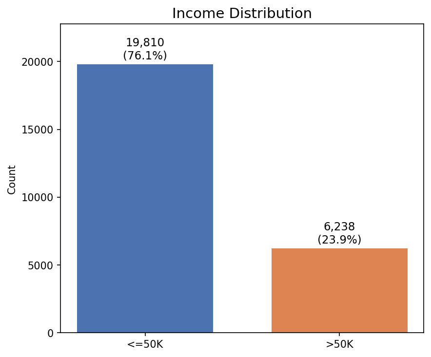
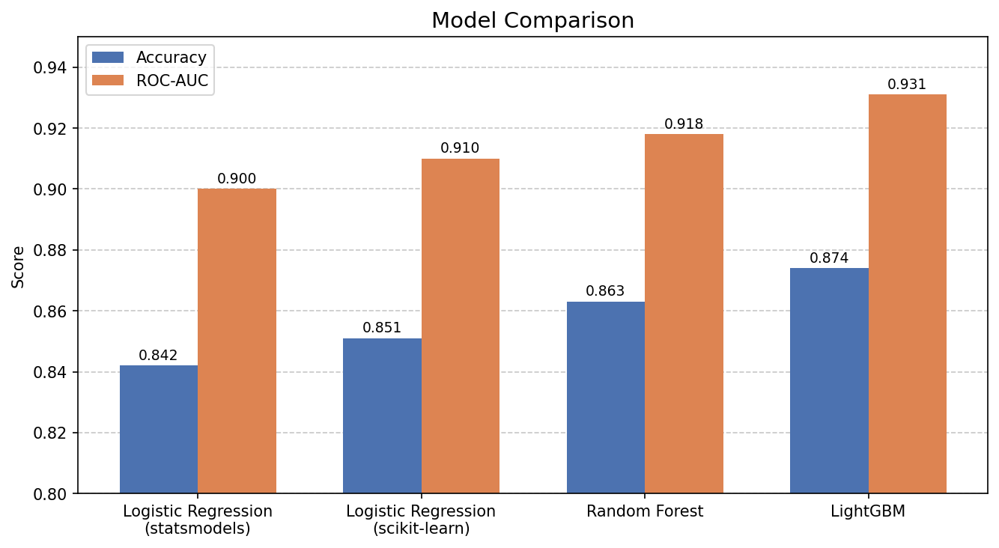
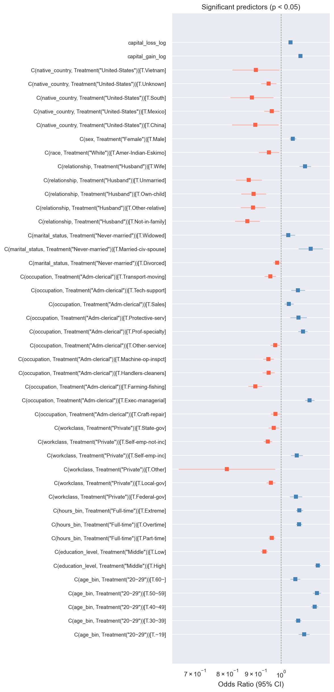
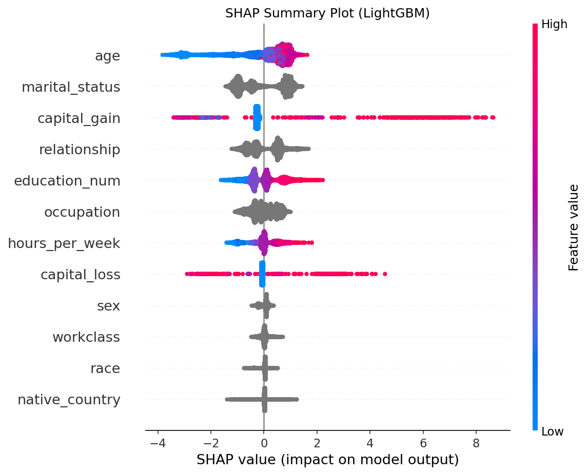
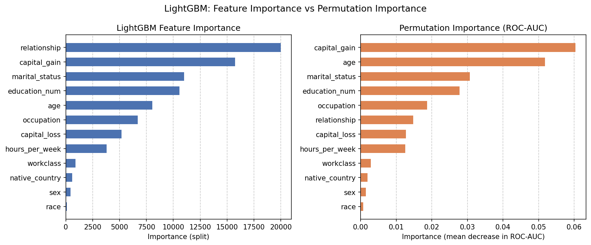
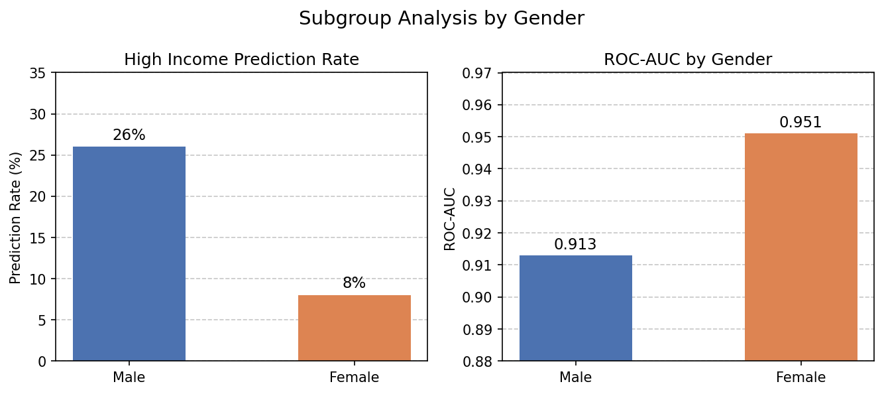

# Adult Census Income Dataset — 所得予測分析

## 概要

米国国勢調査データ（[Adult Census Income Dataset](https://www.kaggle.com/datasets/uciml/adult-census-income)）を用いて、個人の属性情報から年収が $50K を超えるかどうかを予測する二値分類タスクに取り組んだ。  
ロジスティック回帰・ランダムフォレスト・LightGBM の3モデルを比較し、オッズ比・特徴量重要度・SHAP値による多角的な解釈分析を行った。

本分析では予測精度の追求にとどまらず、**収入に影響を与える要因を「本人のコントロール外（人種・性別など）」と「本人のコントロール内（学歴・職業など）」に分けて考察する**ことを主なテーマとする。  
なお、本分析はあくまで相関関係の記述に留まるものであり、因果関係の特定を目的とするものではない。


*図1: データ全体における収入分布（≤50K vs >50K）*

-----

## 使用データ

- **データソース**: UCI Machine Learning Repository — Adult Dataset
- **サンプル数**: 約 48,000 件
- **対象期間**: 1994年（米国国勢調査）
- **目的変数**: `income`（`>50K` / `<=50K`）
- **主な特徴量**: age, education, occupation, marital_status, capital_gain, capital_loss, hours_per_week, など

-----

## 分析の流れ

```
データ読み込み・前処理
  ↓
特徴量エンジニアリング
  ├─ age → age_bin（~19 / 20~29 / 30~39 / 40~49 / 50~59 / 60~）
  ├─ education → education_level（High / Middle / Low）
  ├─ hours_per_week → hours_bin（Part-time / Full-time / Overtime / Extreme）
  ├─ capital_gain / capital_loss → 対数変換（log1p）
  └─ カテゴリ変数のエンコーディング
  ↓
モデル構築・評価（Logistic Regression / Random Forest / LightGBM）
  ↓
解釈分析（オッズ比 / Feature Importance / SHAP）
  ↓
サブグループ分析（性別ごとのモデル性能）
  ↓
要因分析（コントロール外 vs コントロール内）
```

-----

## モデル比較

|モデル                              |Accuracy |ROC-AUC  |
|---------------------------------|---------|---------|
|Logistic Regression（statsmodels） |0.842    |0.900    |
|Logistic Regression（scikit-learn）|0.851    |0.910    |
|Random Forest                    |0.863    |0.918    |
|**LightGBM**                     |**0.874**|**0.931**|

LightGBM が最も高い精度を記録した。


*図2: 各モデルの Accuracy / ROC-AUC 比較*

-----

## ロジスティック回帰：オッズ比による解釈

statsmodels を用いたロジスティック回帰モデルのオッズ比（有意な変数のみ）を示す。  
各値は「他の変数を統制した上で、当該カテゴリが基準カテゴリと比べて高収入のオッズが何%変化するか」を表す。

### 主な結果

**資本収益 / 資本損失**

- `capital_gain` が1増加するごとに高収入のオッズは **+8%**
- `capital_loss` が1増加するごとに高収入のオッズは **+4%**

> ⚠️ `capital_gain` / `capital_loss` については後述の「capital_gain/loss の解釈上の注意」を参照。

**年齢（基準: 20~29歳）**

- 50〜59歳が最も高く **+16%**、次いで40〜49歳 **+15%**
- 年齢が上がるほど高収入傾向（ただし60歳以降は +6% に低下）

**学歴（基準: Middle）**

- High（高学歴）: **+16%**
- Low（低学歴）: **−7%**

**職業（基準: Adm-clerical）**

- Exec-managerial: **+13%**（最も高い）
- Prof-specialty: **+9%**
- Farming-fishing: **−10%**（最も低い）

**婚姻状況（基準: Never-married）**

- Married-civ-spouse: **+13%**

**性別（基準: Female）**

- Male: **+5%**

**その他の傾向**

- 週労働時間が多いほど（Overtime / Extreme）高収入オッズが高い
- 自営（法人）はプライベートより高収入傾向、無法人自営は低い傾向
- 米国外出身（中国・ベトナム・南部）は米国出身より低収入傾向


*図3: ロジスティック回帰によるオッズ比（有意な変数のみ）。1を基準に右方向が高収入と正の相関、左方向が負の相関を示す（対数スケール）。*

-----

## 特徴量重要度（Random Forest）

|特徴量                              |Importance|
|---------------------------------|----------|
|capital_gain                     |0.164     |
|education_num                    |0.141     |
|marital_status_Married-civ-spouse|0.124     |
|relationship_Husband             |0.097     |
|age                              |0.080     |
|marital_status_Never-married     |0.054     |
|hours_per_week                   |0.050     |
|capital_loss                     |0.039     |
|occupation_Exec-managerial       |0.034     |
|occupation_Prof-specialty        |0.027     |

-----

## SHAP 分析（LightGBM）

SHAP 値を用いてモデルの予測根拠を可視化した。

- **capital_gain**: 投資収入が大きい個人ほど高所得方向へ強く寄与。最も影響力の大きい特徴量。
- **age**: 若いほど低所得方向、年齢が高いほど高所得方向に寄与。
- **education_num**: 学歴が高いほど高所得方向に寄与。
- **capital_loss**: 損失が大きい個人は資産家である可能性が高く、高所得方向に寄与。


*図4: SHAP Summary Plot（LightGBM）。各点は1サンプルを表し、色が赤いほど特徴量の値が大きく、青いほど小さい。横軸はSHAP値（正が高収入方向への寄与）。*

### 重要特徴量の総合評価

Feature Importance と Permutation Importance を並べて比較すると、両者の順位に違いが見られる。


*図5: LightGBM の Feature Importance（左）と Permutation Importance（右）の比較。Feature Importance では `relationship` が最上位であるが、Permutation Importance では `capital_gain`・`age` が上位となっている。*

Feature Importance で `relationship` が最上位となった一方、Permutation Importance では `capital_gain` と `age` が上位となった。これは `relationship` と `marital_status` の間に強い相関があり、一方の特徴量をシャッフルしても他方が補完するため、Permutation Importance では過小評価されやすいためと考えられる。

複数の指標を総合すると、所得予測に特に重要な特徴量は以下の通りである。

1. **capital_gain**（投資収入）
2. **age**（年齢）
3. **marital_status**（婚姻状況）
4. **education_num**（学歴年数）

### capital_gain / capital_loss の解釈上の注意

`capital_gain` / `capital_loss` はモデルの予測精度に最も大きく貢献する特徴量だが、**収入の原因というより結果である可能性が高い**点に注意が必要である。

投資・資産運用によって生じるキャピタルゲイン/ロスは、そもそも投資できるだけの元手（貯蓄）があることを前提とする。これは「貯蓄額が多い人は年収が高い」という関係に近く、**貯蓄額を使って収入を予測することは高精度であっても、貯蓄額が収入の原因とは言えない**のと同様である。

このような**逆因果（Reverse Causality）**の可能性があるため、本変数は予測モデルの精度向上には寄与するものの、後述の「要因分析」においては議論の対象から除外する。

-----

## サブグループ分析：性別ごとのモデル性能

|グループ  |高所得予測率|ROC-AUC|
|------|------|-------|
|Male  |約 26% |0.913  |
|Female|約 8%  |0.951  |

- 男性の方が高所得と予測される割合が高く、データの実際の所得分布を反映している。
- 一方でモデル性能（ROC-AUC）は女性の方が高い値を示した。これは女性の高所得者が高学歴・特定職種など特徴的な属性を持つことが多く、モデルが識別しやすいためと考えられる。


*図6: 性別ごとの高所得予測率と ROC-AUC の比較*

-----

## 要因分析：コントロール外 vs コントロール内

本分析の主テーマである「本人のコントロール外の要因とコントロール内の要因で、どちらが収入により影響を与えるか」について考察する。  
なお、逆因果の観点から `capital_gain` / `capital_loss` はここでの議論から除外する。

### 変数の分類

| 分類 | 変数 | 備考 |
|---|---|---|
| **コントロール外** | `sex`（性別）| 出生時に決まる |
| **コントロール外** | `race`（人種）| 出生時に決まる |
| **コントロール外** | `native_country`（出身国）| 基本的に選択不可 |
| **コントロール外** | `age`（年齢）| 時間の経過であり選択不可 |
| **コントロール内** | `education`（学歴）| 本人の努力・選択 |
| **コントロール内** | `occupation`（職業）| 本人の選択 |
| **コントロール内** | `hours_per_week`（労働時間）| 本人の選択 |
| **グレーゾーン** | `marital_status`（婚姻状況）| 選択だが文化・経済状況にも依存 |

### 考察

オッズ比・特徴量重要度の結果を踏まえると、以下のことが言える。

**コントロール外の要因について**  
性別（Male: +5%）や人種・出身国は統計的に有意な影響を持つ。しかしその効果量は、学歴（High: +16%）や職業（Exec-managerial: +13%）と比べると相対的に小さい。

**コントロール内の要因について**  
学歴・職業・労働時間はいずれも収入と強い関連を示し、特に学歴と職業の影響は大きい。

**総合的な示唆**  
このデータの範囲においては、**コントロール内の要因（学歴・職業）の方が収入との相関が強い**という結果が得られた。ただし、以下の点には留意が必要である。

- 学歴や職業の選択それ自体が、人種・性別・家庭環境などコントロール外の要因に影響されている可能性がある
- 本分析は相関関係の記述であり、因果関係の特定ではない
- 1994年の米国データであり、現代・他国への一般化には限界がある

-----

## 使用技術

- **言語**: Python 3.x
- **ライブラリ**: pandas / numpy / scikit-learn / statsmodels / lightgbm / shap / matplotlib / seaborn

-----

## ファイル構成

```
.
├── data/
│   └── adult.csv                # 元データ（Kaggle からダウンロード）
├── images/
│   ├── income_distribution.png  # 図1: 収入分布
│   ├── model_comparison.png     # 図2: モデル比較
│   ├── odds_ratio.png           # 図3: オッズ比
│   ├── shap_summary.png         # 図4: SHAP Summary Plot
│   └── subgroup_analysis.png    # 図5: サブグループ分析
├── notebooks/
│   └── EDA.ipynb                # 分析メインノートブック
│   ├── statsmodels.ipynb        # 
│   ├── scikit-learn.ipynb       # 
│   ├── LightGBM.ipynb           #  
└── README.md
```

-----

## 参考

- [UCI Adult Dataset](https://archive.ics.uci.edu/ml/datasets/adult)
- [Kaggle: Adult Census Income](https://www.kaggle.com/datasets/uciml/adult-census-income)
