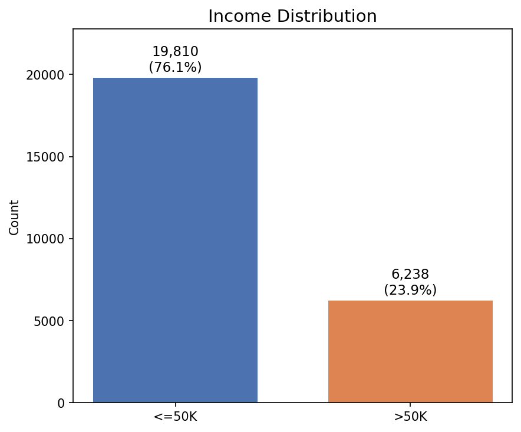
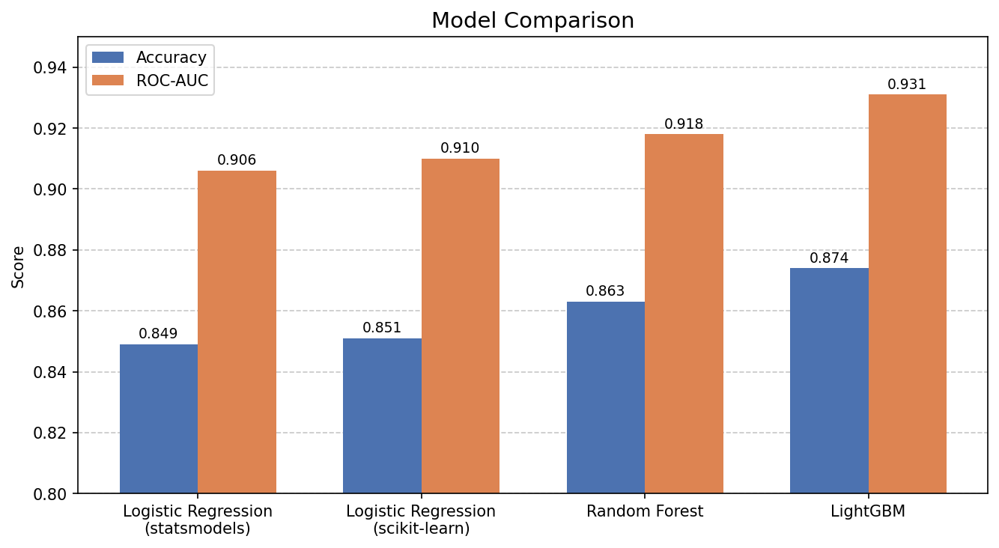
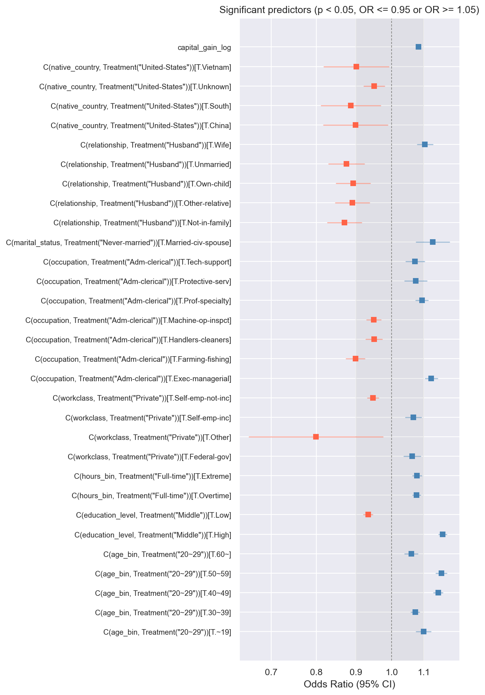
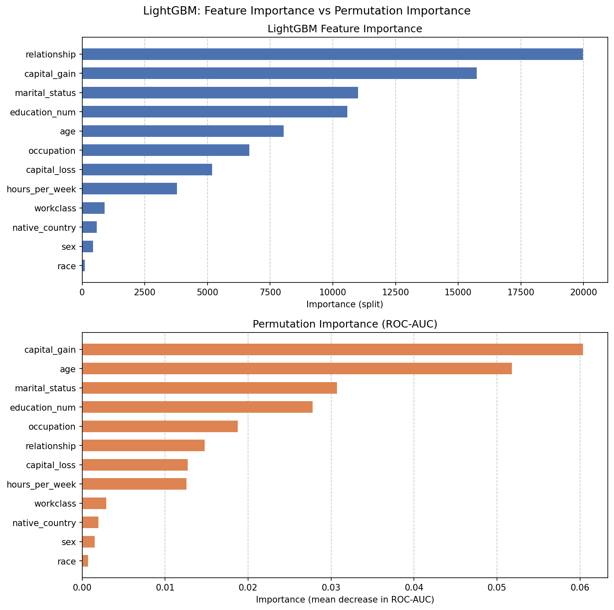
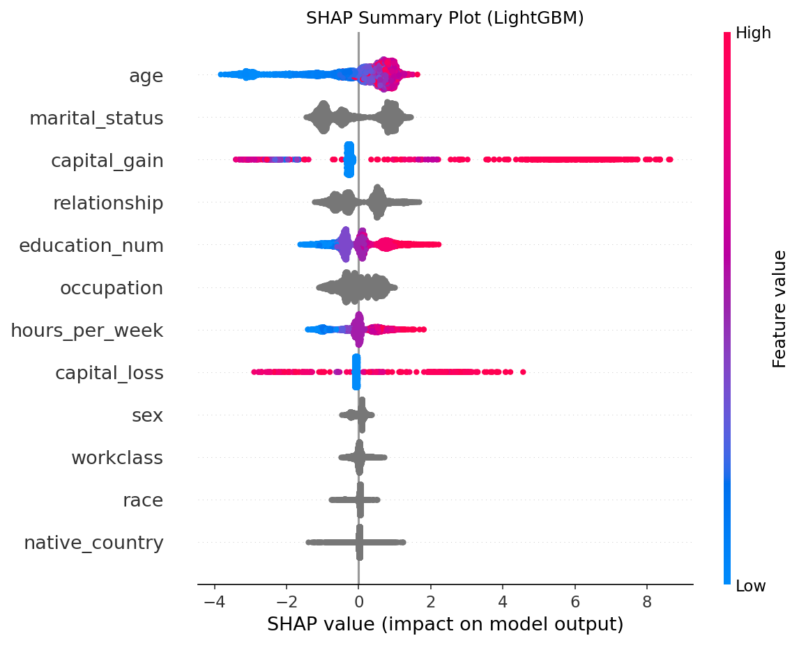
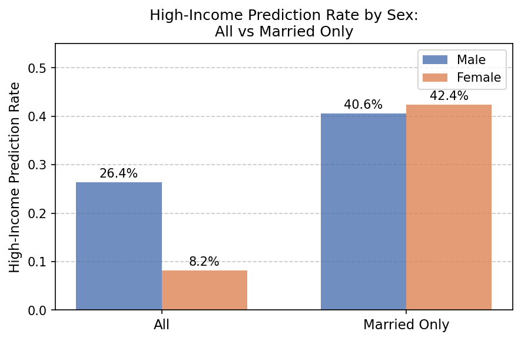
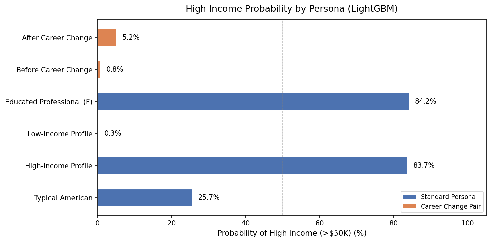
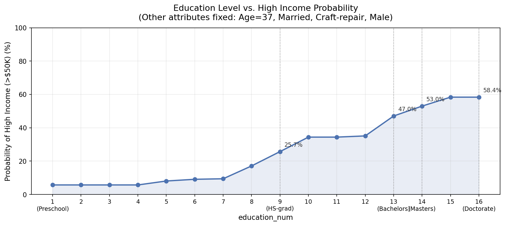
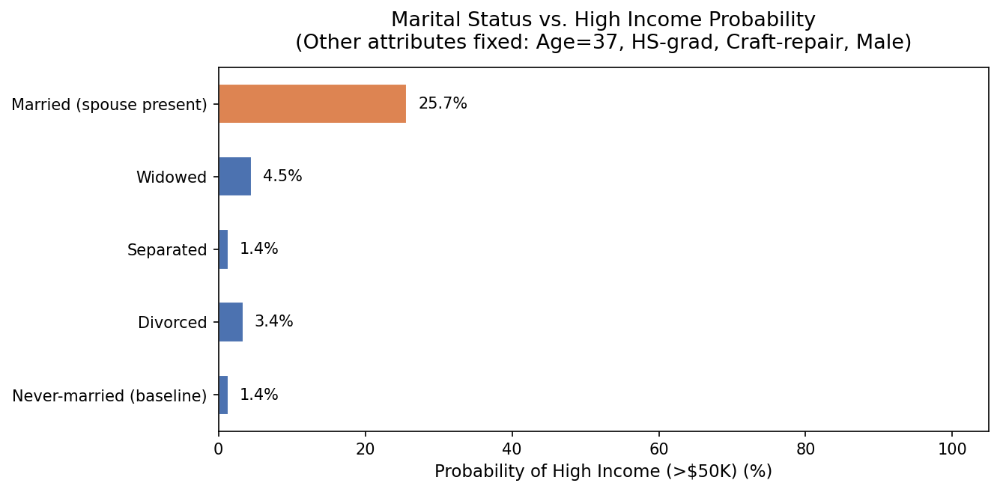
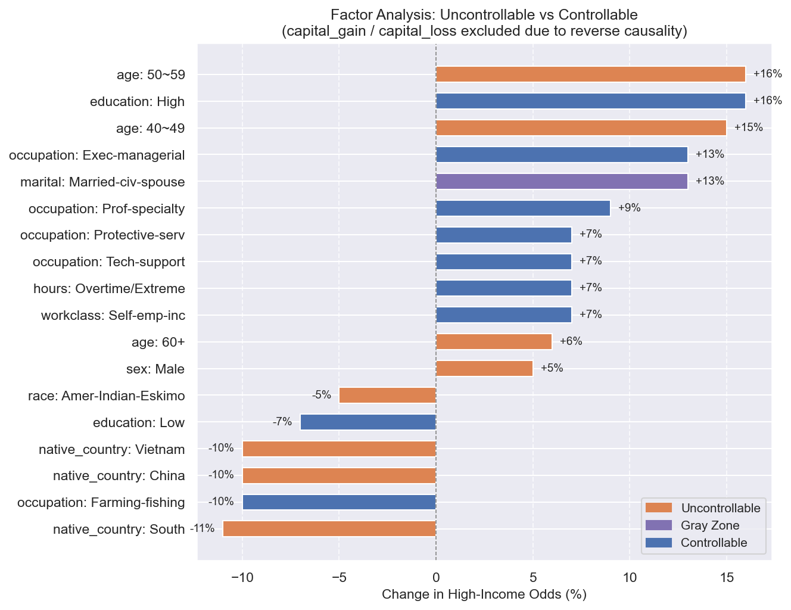

# Adult Census Income Dataset — 所得予測分析

## 概要

米国国勢調査データ（[Adult Census Income Dataset](https://www.kaggle.com/datasets/uciml/adult-census-income)）を用いて、個人の属性情報から年収が $50K を超えるかどうかを予測する二値分類タスクに取り組んだ。  
ロジスティック回帰・ランダムフォレスト・LightGBM の3モデルを比較し、オッズ比・特徴量重要度・SHAP値による多角的な解釈分析を行った。

本分析では予測精度の追求にとどまらず、**収入に影響を与える要因を「本人のコントロール外（人種・性別など）」と「本人のコントロール内（学歴・職業など）」に分けて考察する**ことを主なテーマとする。  
なお、本分析はあくまで相関関係の記述に留まるものであり、因果関係の特定を目的とするものではない。


*図1: データ全体における収入分布（≤50K vs >50K）*

-----

## 使用データ

- **データソース**: UCI Machine Learning Repository — Adult Dataset
- **サンプル数**: 約 33,000 件（学習データ: 約 26,000 件、テストデータ: 約 7,000 件 ）
- **対象期間**: 1994年（米国国勢調査）
- **目的変数**: `income`（`>50K` / `<=50K`）
- **主な特徴量**: age, education, occupation, marital_status, capital_gain, capital_loss, hours_per_week, など

-----

## 分析の流れ

```
データ読み込み・前処理
  ↓
特徴量エンジニアリング
  ├─ age → age_bin（~19 / 20~29 / 30~39 / 40~49 / 50~59 / 60~）
  ├─ education → education_level（Low / Middle / High）
  ├─ hours_per_week → hours_bin（Part-time / Full-time / Overtime / Extreme）
  ├─ capital_gain / capital_loss → 対数変換（log1p） → 標準化
  └─ カテゴリ変数のエンコーディング
  ↓
モデル構築・評価（Logistic Regression / Random Forest / LightGBM）
  ↓
解釈分析（オッズ比 / Feature Importance / SHAP）
  ↓
サブグループ分析（性別ごとのモデル性能）
  ↓
要因分析（コントロール外 vs コントロール内）
```

-----

## モデル比較

|モデル                              |Accuracy |ROC-AUC  |
|---------------------------------|---------|---------|
|Logistic Regression（statsmodels） |0.842    |0.900    |
|Logistic Regression（scikit-learn）|0.851    |0.910    |
|Random Forest                    |0.863    |0.918    |
|**LightGBM**                     |**0.874**|**0.931**|

LightGBM が最も高い精度を記録した。


*図2: 各モデルの Accuracy / ROC-AUC 比較*

-----

## ロジスティック回帰：オッズ比による解釈
statsmodels を用いたロジスティック回帰モデルのオッズ比（有意な変数のみ）を示す。  
各値は「他の変数を統制した上で、当該カテゴリが基準カテゴリと比べて高収入のオッズが何%変化するか」を表す。

### 参照カテゴリの選定方針
各カテゴリ変数の基準（参照カテゴリ）は、原則として**各変数内で最も人数が多いカテゴリ**（マジョリティ）を機械的に選定した。  
ただし以下の2変数は、解釈のしやすさを優先して理論的根拠に基づき例外とした。

| 変数 | 基準カテゴリ | 選定理由 |
|---|---|---|
| 年齢 | 20〜29歳（マジョリティは30〜39歳） | 最年少の就労世代を起点とし、年齢上昇の効果を順に追うため |
| 職業 | 事務職（マジョリティはProf-specialty） | 事務職が中間的な職種として解釈の錨になるため。Prof-specialtyを基準にすると他職種がほぼ全てマイナスになり解釈が歪む |

参照カテゴリの選択はオッズ比の符号・大きさの「表現」を変えるが、**モデルの結論（どの変数が影響力が大きいか）は変わらない**。

### 主な結果
**資本収益 / 資本損失**
- `capital_gain` が1増加するごとに高収入のオッズは **+8%**
- `capital_loss` が1増加するごとに高収入のオッズは **+4%**
> ※ `capital_gain` / `capital_loss` については後述の「capital_gain/loss の解釈上の注意」を参照。  
> ※ 両変数は0が大多数を占めるため、信頼区間が極めて狭く図中では点として描画される。

**年齢（基準: 20〜29歳）**
- 50〜59歳が最も高く **+16%**、次いで40〜49歳 **+15%**
- 年齢が上がるほど高収入傾向（ただし60歳以降は +6% に低下）

**学歴（基準: 中程度）**
- 高学歴（High）: **+16%**
- 低学歴（Low）: **−7%**

**労働時間（基準: フルタイム）**
- 残業（Overtime）/ 超過労働（Extreme）: **+8%**
- パートタイム（Part-time）: **−4%**

**職業（基準: 事務職）**
- 経営層・管理職（Exec-managerial）: **+13%**（最も高い）
- 専門職（医師・弁護士・会計士・研究者など）（Prof-specialty）: **+9%**
- 保安職（Protective-serv）: **+7%**
- 技術サポート（Tech-support）: **+7%**
- 輸送・運転（Transport-moving）: **−4%**
- 運搬・清掃（Handlers-cleaners）: **−5%**
- 機械オペレーター（Machine-op-inspct）: **−5%**
- 農業・漁業（Farming-fishing）: **−10%**（最も低い）

**婚姻状況（基準: 既婚・配偶者同居）**
- 死別（Widowed）: **−9%**
- 既婚・配偶者不在（単身赴任・収監等）（Married-spouse-absent）: **−10%**
- 別居・離婚協議中（Separated）: **−11%**
- 未婚（Never-married）: **−12%**
- 離婚（Divorced）: **−13%**

**関係性（基準: 夫）**
- 妻（Wife）: **+10%**
- 子（Own-child）/ その他親族（Other-relative）: **−11%**
- 家族外（Not-in-family）/ 未婚パートナー（Unmarried）: **−13%**

**人種（基準: 白人）**
- アメリカ先住民（Amer-Indian-Eskimo）: **−5%**

**性別（基準: 男性）**
- 女性（Female）: **−5%**
> ※ `relationship: Wife` の +10% と `sex: Female` の −5% は一見矛盾するが、これは比較対象の違いによる。前者は既婚かつ就労している女性に限定した比較であり、就労を継続している既婚女性はキャリア志向の選択集団である可能性が高い。実際、後述のサブグループ分析では既婚者に限定すると高所得予測率が女性42%・男性41%と逆転することが確認できる。

**出身国（基準: 米国）**
- メキシコ（Mexico）: **−4%**
- 中国（China）: **−10%**
- ベトナム（Vietnam）: **−10%**
- 南部諸国（South）: **−11%**

**その他の傾向**
- 自営（法人）は民間企業より高収入傾向、自営（非法人）は低収入傾向


*図3: ロジスティック回帰によるオッズ比（有意な変数のみ）。1を基準に右方向が高収入と正の相関、左方向が負の相関を示す（対数スケール）。*

-----

## 特徴量重要度（Random Forest）

|特徴量                              |Importance|
|---------------------------------|----------|
|capital_gain                     |0.164     |
|education_num                    |0.141     |
|marital_status_Married-civ-spouse|0.124     |
|relationship_Husband             |0.097     |
|age                              |0.080     |
|marital_status_Never-married     |0.054     |
|hours_per_week                   |0.050     |
|capital_loss                     |0.039     |
|occupation_Exec-managerial       |0.034     |
|occupation_Prof-specialty        |0.027     |

-----

## 重要特徴量の総合評価（LightGBM）

Feature Importance と Permutation Importance を並べて比較すると、両者の順位に違いが見られる。


*図4: LightGBM の Feature Importance（上）と Permutation Importance（下）の比較。Feature Importance では `relationship` が最上位であるが、Permutation Importance では `capital_gain`・`age` が上位となっている。*

Feature Importance で `relationship` が最上位となった一方、Permutation Importance では `capital_gain` と `age` が上位となった。これは `relationship` と `marital_status` の間に強い相関があり、一方の特徴量をシャッフルしても他方が補完するため、Permutation Importance では過小評価されやすいためと考えられる。

複数の指標を総合すると、所得予測に特に重要な特徴量は以下の通りである。

1. **capital_gain**（投資収入）
2. **age**（年齢）
3. **marital_status**（婚姻状況）
4. **education_num**（学歴年数）

## SHAP 分析（LightGBM）

SHAP 値を用いてモデルの予測根拠を可視化した。

- **age**: 若いほど低所得方向、年齢が高いほど高所得方向に寄与。最も影響力の大きい特徴量。
- **capital_gain**: 資本収益が大きい個人ほど高所得方向へ強く寄与。`capital_gain`は、資産を持つ一部の個人に対して強い影響を与えるが、全体的な重要度では`age`が最上位である。
- **education_num**: 学歴が低いほど低所得方向、学歴が高いほど高所得方向に寄与。
- **hours_per_week**: 労働時間が短いほど低所得方向、労働時間が長いほど高所得方向に寄与。
- **capital_loss**: 資本損失が大きい個人は資産家である可能性が高く、高所得方向に寄与。
- `marital_status`・`relationship`・`occupation`・`sex`・`workclass`・`race`・`native_country`などはカテゴリ変数であり、高低の方向解釈ができないため灰色となっている。


*図5: SHAP Summary Plot（LightGBM）。各点は1サンプルを表し、色が赤いほど特徴量の値が大きく、青いほど小さい。横軸はSHAP値（正が高収入方向への寄与）。*

### capital_gain / capital_loss の解釈上の注意

`capital_gain` / `capital_loss` はモデルの予測精度に最も大きく貢献する特徴量だが、**収入の原因というより結果である可能性が高い**点に注意が必要である。

投資・資産運用によって生じるキャピタルゲイン/ロスは、そもそも投資できるだけの元手（貯蓄）があることを前提とする。これは「貯蓄額が多い人は年収が高い」という関係に近く、**貯蓄額を使って収入を予測することは高精度であっても、貯蓄額が収入の原因とは言えない**のと同様である。

このような**逆因果**(Reverse Causality)の可能性があるため、本変数は予測モデルの精度向上には寄与するものの、後述の「要因分析」においては議論の対象から除外する。

-----

## サブグループ分析：性別ごとのモデル性能
| グループ | 高所得予測率（全体） | 高所得予測率（既婚者限定） | ROC-AUC |
|------|------|------|-------|
| Male | 約26% | 約41% | 0.913 |
| Female | 約8% | 約42% | 0.951 |

- 全体では男性の方が高所得と予測される割合が高く、データの実際の所得分布を反映している。
- 一方で既婚者に限定すると、高所得予測率は女性42%・男性41%と逆転する。就労を継続している既婚女性はキャリア志向の選択集団である可能性が高く、女性全体の平均（8%）とは異なる集団を捉えていることに留意が必要である。
- また、モデル性能（ROC-AUC）は女性の方が高い値を示した。これは女性の高所得者が高学歴・特定職種など特徴的な属性を持つことが多く、モデルが識別しやすいためと考えられる。


*図6: 性別ごとの高所得予測率の比較（全体 vs 既婚者限定）*

-----

## What-If 分析：架空ペルソナによる高収入確率シミュレーション

実業務では「この属性の顧客が離脱する確率は？」のように、
モデルから確率を算出して意思決定の材料とするケースが多い。
本セクションでは、LightGBM モデルを用いて架空の人物の属性から
高収入確率を算出し、その変化を可視化する。  
なお `capital_gain` / `capital_loss` は逆因果の懸念から全ペルソナで 0 に統一した。

### ① ペルソナ比較

*図7: 6つの架空ペルソナ別の高収入確率（LightGBM）。
転換前後（オレンジ）は同一人物が学歴・職業のみを変えたケースを示す。*

### ② 感度分析：学歴の変化

*図8: 典型的米国人（37歳・既婚・事務職）の education_num を
1〜16 で変化させたときの高収入確率推移。*

### ③ 感度分析：婚姻状況の変化

*図9: 同一人物（高卒・事務職・37歳男性）の婚姻状況を変化させたときの比較。
既婚（配偶者同居）とその他の婚姻状況との差が明確に現れる。*

-----

## 要因分析：コントロール外 vs コントロール内

本分析の主テーマである「本人のコントロール外の要因とコントロール内の要因で、どちらが収入により影響を与えるか」について考察する。  
なお、逆因果の観点から `capital_gain` / `capital_loss` はここでの議論から除外する。

### 変数の分類
| 分類 | 変数 | 備考 |
|---|---|---|
| **コントロール外** | `sex`（性別）| 出生時に決まる |
| **コントロール外** | `race`（人種）| 出生時に決まる |
| **コントロール外** | `native_country`（出身国）| 基本的に選択不可 |
| **コントロール内** | `education`（学歴）| 本人の努力・選択 |
| **コントロール内** | `occupation`（職業）| 本人の選択 |
| **コントロール内** | `hours_per_week`（労働時間）| 本人の選択 |
| **グレーゾーン** | `age`（年齢）| 時間の経過は選択不可だが、全員が等しく経験するため不平等の構造的源泉とは異なる |
| **グレーゾーン** | `marital_status`（婚姻状況）| 選択だが文化・経済状況にも依存 |

### 考察


*図10: 各変数の高収入オッズへの影響（%）。オレンジがコントロール外、青がコントロール内、グレーがグレーゾーン。*

オッズ比・特徴量重要度の結果を踏まえると、以下のことが言える。

**コントロール外の要因について**  
性別については女性が男性より −5% と負の影響を示す。出身国（South: -11%、Vietnam・China: -10%）や人種（Amer-Indian-Eskimo: -5%）も同様に負の影響を示した。

**グレーゾーンの要因について**  
年齢（50〜59: +16%、40〜49: +15%）は収入に強い正の影響を持つ。婚姻状況については既婚・配偶者同居を基準とすると、それ以外の全カテゴリが −9〜−13% と負の影響を示した。

**コントロール内の要因について**  
学歴・職業・労働時間はいずれも収入と強い関連を示し、特に学歴（High: +16%、Low: -7%）と職業（Exec-managerial: +13%、Farming-fishing: -10%）の影響は大きい。

**総合的な示唆**  
図全体を見ると、収入を下げる要因はコントロール外（出身国・人種・性別）が中心である一方、収入を上げる要因にはグレーゾーン（年齢）とコントロール内（学歴・職業・労働時間）が多く含まれるという傾向が見られる。また、以下の点には留意が必要である。

- 今回コントロール内に分類した学歴や職業の選択それ自体が、人種・性別・家庭環境などコントロール外の要因に影響されている可能性がある
- 横断データのため、年齢の効果はコホート効果（世代による時代背景の差）と加齢効果（経験・職位の蓄積）を分離できていない
- 本分析は相関関係の記述であり、因果関係の特定ではない
- 1994年の米国データであり、現代・他国への一般化には限界がある

-----

## 使用技術

- **言語**: Python 3.x
- **ライブラリ**: pandas / numpy / statsmodels / scikit-learn / lightgbm / shap / matplotlib

-----

## ファイル構成

```
.
├── data/
│   └── adult.csv                         # 元データ（Kaggle からダウンロード）
├── images/
│   ├── income_distribution.png           # 図1: 収入分布
│   ├── model_comparison.png              # 図2: モデル比較
│   ├── odds_ratio.png                    # 図3: オッズ比
│   ├── feature_importance_comparison.png # 図4: Feature Importance 比較
│   ├── shap_summary.png                  # 図5: SHAP Summary Plot
│   ├── subgroup_analysis.png             # 図6: サブグループ分析
│   └── factor_analysis.png               # 図7: 要因分析
├── notebooks/
│   ├── EDA.ipynb                         # 探索的データ分析
│   ├── statsmodels.ipynb                 # ロジスティック回帰・オッズ比
│   ├── scikit-learn.ipynb                # 機械学習モデル比較
│   └── LightGBM.ipynb                    # LightGBM・SHAP分析
└── README.md
```

-----

## 参考

- [UCI Adult Dataset](https://archive.ics.uci.edu/ml/datasets/adult)
- [Kaggle: Adult Census Income](https://www.kaggle.com/datasets/uciml/adult-census-income)
